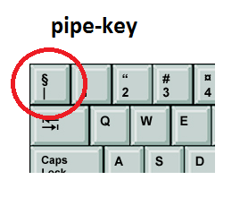

# Writing good documentation 

## Step 1 - Using Codeblocks

Codeblocks in markdown make it *very easy* for tech people to **copy, paste, share** code. 

A good __cloud engineer__ uses codeblocks whenever possible. It allows others to copy and paste their codes to replicate or to research issues. For example, the following code in Ruby is in a Codeblock. 

- In markdown the codeblock is separated by three backticks. ```

```
def factorial(n)
  if n <= 1
    return 1
  else
    return n * factorial(n - 1)
  end
end

# Test the factorial function
number = 5
result = factorial(number)
puts "The factorial of #{number} is #{result}"
```
The above code in Ruby calculates the factorial of a number using the recursive function. 

- When you can you should use syntax highlighting of your codeblocks.

```ruby
def factorial(n)
  if n <= 1
    return 1
  else
    return n * factorial(n - 1)
  end
end

# Test the factorial function
number = 5
result = factorial(number)
puts "The factorial of #{number} is #{result}"
```


- Format for images is ! [name of image] and url in ( ) 
- You can't resize images directly in github flavoured markdown 
- You can use html < and specifying the width in pixels 


- Good Cloud Engineers use codeblocks for both code and errors in the console.
- If you want to show an error from the console or the terminal, you should use bash after the backticks as you're using a bash terminal.
> This is an example of an error 

```bash
Traceback (most recent call last):
  (irb):1:in `<main>'
NameError (undefined local variable or method `undefined_variable' for main:Object)
```

## Step 2 - Use Github flavoured markdown Task lists 

Github extends markdown to have a list where you can check off items. <sup>[1]<sup/>

- [ ] Finish step 1
- [ ] Finish step 2
- [ ] Finish step 3

## Step 3 - Using emojis in Github Flavored Markdown (GFM) 
- GFM suports emoji shortcodes
  
## Step 4 - How to create a table 
| Name | bar | emoji |
| --- | --- | --- |
| cloud | `:cloud:` | ☁️
| smile | `:smile:` | 😄
| thumbs up | `thumbsup:` | 👎
- Refer to the cheat sheet below <sup>[2]<sup/>

## Step 5 - Adding assets direct to Github means you can share and link direct from a folder on here. 
- use the image format ! []()


## Step 6 - Take screenshots rather than phone photos. 
- Don't upload photos that you have taken with your phone because you can't see it properly or copy
- When you can always provide a codeblock. 


## Linking to another file on Github 
- create folder with file and use []()

[Markdown Overview].(github-docs/Overview/Markdown.md).

- To add links copy and paste the url. Put a friendly name into square braces and keep url in parenthesis.
  
## References

- [Github flavored Mardown Spec](https://github.github.com/gfm/)
- [Basic Writing & Formattting Syntax](https://docs.github.com/en/get-started/writing-on-github/getting-started-with-writing-and-formatting-on-github/basic-writing-and-formatting-syntax)
- [Task Lists](https://docs.github.com/en/get-started/writing-on-github/getting-started-with-writing-and-formatting-on-github/basic-writing-and-formatting-syntax#task-lists) <sup>[1]<sup/>
-[Emoji cheat sheet](https://www.webfx.com/tools/emoji-cheat-sheet/) <sup>[2]<sup/>


